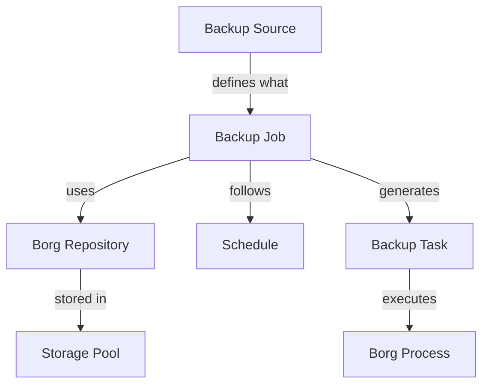

# phpBorg Professional Backup System Redesign

## 🎯 Enterprise-Grade Architecture

### Core Concepts Clarification



### 1️⃣ **Backup Sources** (New Concept)
What we're backing up - the origin of data:

```sql
CREATE TABLE `backup_sources` (
  `id` int(11) NOT NULL AUTO_INCREMENT,
  `name` varchar(100) NOT NULL COMMENT 'Source name (e.g., Production MySQL)',
  `type` enum('mysql','postgresql','files','docker','vm','custom') NOT NULL,
  `server_id` int(11) NOT NULL COMMENT 'Server where source is located',
  
  -- Type-specific configuration (JSON)
  `config` JSON NOT NULL COMMENT 'Type-specific config (DB name, file paths, container ID, etc.)',
  
  -- Common settings
  `paths` JSON DEFAULT NULL COMMENT 'File paths for file-type backups',
  `exclude_patterns` JSON DEFAULT NULL COMMENT 'Exclusion patterns',
  `pre_backup_script` text DEFAULT NULL COMMENT 'Script to run before backup',
  `post_backup_script` text DEFAULT NULL COMMENT 'Script to run after backup',
  
  -- Metadata
  `tags` JSON DEFAULT NULL COMMENT 'Tags for categorization',
  `active` tinyint(1) NOT NULL DEFAULT 1,
  `created_at` datetime NOT NULL,
  `updated_at` datetime DEFAULT NULL,
  
  PRIMARY KEY (`id`),
  KEY `server_id` (`server_id`),
  KEY `type` (`type`),
  KEY `active` (`active`)
);
```

Example configs:
- MySQL: `{"database": "myapp", "port": 3306, "user": "backup", "dump_options": "--single-transaction"}`
- Files: `{"paths": ["/var/www", "/etc/nginx"], "follow_symlinks": false}`
- Docker: `{"container": "app_container", "volumes": true, "stop_during_backup": false}`

### 2️⃣ **Advanced Scheduling System**

```sql
-- Replace single day with flexible schedule
CREATE TABLE `backup_schedules` (
  `id` int(11) NOT NULL AUTO_INCREMENT,
  `job_id` int(11) NOT NULL,
  
  -- Schedule type
  `type` enum('interval','daily','weekly','monthly','cron','advanced') NOT NULL,
  
  -- Time settings
  `time` time NOT NULL COMMENT 'Backup time (HH:MM:SS)',
  `timezone` varchar(50) DEFAULT 'UTC',
  
  -- Multi-day selection for weekly (bitmap: Mon=1, Tue=2, Wed=4, Thu=8, Fri=16, Sat=32, Sun=64)
  `weekdays` int(11) DEFAULT NULL COMMENT 'Bitmap of selected weekdays',
  
  -- Multi-day selection for monthly (bitmap for days 1-31)
  `monthdays` int(11) DEFAULT NULL COMMENT 'Bitmap of selected month days',
  
  -- Advanced options
  `interval_hours` int(11) DEFAULT NULL COMMENT 'For interval type: run every N hours',
  `cron_expression` varchar(100) DEFAULT NULL COMMENT 'For cron type',
  
  -- Backup window
  `window_start` time DEFAULT NULL COMMENT 'Earliest time to start',
  `window_end` time DEFAULT NULL COMMENT 'Latest time to start',
  `max_runtime` int(11) DEFAULT 14400 COMMENT 'Max runtime in seconds (default 4h)',
  
  -- Blackout periods (JSON array of date ranges)
  `blackout_periods` JSON DEFAULT NULL COMMENT 'Periods when backup should not run',
  
  -- Retry policy
  `retry_on_failure` tinyint(1) DEFAULT 1,
  `max_retries` int(11) DEFAULT 3,
  `retry_delay_minutes` int(11) DEFAULT 30,
  
  PRIMARY KEY (`id`),
  KEY `job_id` (`job_id`),
  CONSTRAINT FOREIGN KEY (`job_id`) REFERENCES `backup_jobs` (`id`) ON DELETE CASCADE
);
```

### 3️⃣ **Redesigned Backup Jobs**

```sql
CREATE TABLE `backup_jobs` (
  `id` int(11) NOT NULL AUTO_INCREMENT,
  `name` varchar(100) NOT NULL,
  `description` text,
  
  -- What to backup
  `source_id` int(11) NOT NULL COMMENT 'What to backup',
  
  -- Where to store it
  `repository_id` int(11) NOT NULL COMMENT 'Borg repository to use',
  
  -- Job settings
  `priority` enum('low','normal','high','critical') DEFAULT 'normal',
  `enabled` tinyint(1) DEFAULT 1,
  
  -- Retention policy (can override repository defaults)
  `retention_override` JSON DEFAULT NULL COMMENT 'Override repository retention',
  
  -- Performance settings
  `bandwidth_limit` int(11) DEFAULT NULL COMMENT 'KB/s, NULL = unlimited',
  `cpu_nice` int(11) DEFAULT 10 COMMENT 'Process nice level (0-19)',
  `compression_level` int(11) DEFAULT NULL COMMENT 'Override compression (1-9)',
  
  -- Notifications
  `notify_channels` JSON DEFAULT NULL COMMENT 'Notification channels and settings',
  `notify_on_success` tinyint(1) DEFAULT 0,
  `notify_on_failure` tinyint(1) DEFAULT 1,
  `notify_on_warning` tinyint(1) DEFAULT 1,
  
  -- Hooks
  `pre_job_hook` text DEFAULT NULL,
  `post_job_hook` text DEFAULT NULL,
  
  -- Dependencies
  `depends_on_job_id` int(11) DEFAULT NULL COMMENT 'Job that must complete first',
  `conflict_jobs` JSON DEFAULT NULL COMMENT 'Jobs that cannot run simultaneously',
  
  -- Stats
  `last_run_at` datetime DEFAULT NULL,
  `last_status` enum('success','warning','failure','cancelled','running') DEFAULT NULL,
  `last_duration_seconds` int(11) DEFAULT NULL,
  `last_size_bytes` bigint(20) DEFAULT NULL,
  `next_run_at` datetime DEFAULT NULL,
  `total_runs` int(11) DEFAULT 0,
  `success_runs` int(11) DEFAULT 0,
  `failed_runs` int(11) DEFAULT 0,
  
  -- Metadata
  `tags` JSON DEFAULT NULL,
  `created_at` datetime NOT NULL,
  `updated_at` datetime DEFAULT NULL,
  
  PRIMARY KEY (`id`),
  KEY `source_id` (`source_id`),
  KEY `repository_id` (`repository_id`),
  KEY `enabled_next_run` (`enabled`, `next_run_at`),
  KEY `priority` (`priority`),
  CONSTRAINT FOREIGN KEY (`source_id`) REFERENCES `backup_sources` (`id`),
  CONSTRAINT FOREIGN KEY (`repository_id`) REFERENCES `repository` (`id`)
);
```

### 4️⃣ **Enhanced Storage Pools**

```sql
ALTER TABLE `storage_pools` ADD COLUMN 
  `type` enum('local','nfs','s3','sftp','smb','azure','gcs') DEFAULT 'local',
  `config` JSON DEFAULT NULL COMMENT 'Type-specific configuration',
  `encryption_key` text DEFAULT NULL COMMENT 'Pool-level encryption key',
  `performance_tier` enum('archive','standard','performance') DEFAULT 'standard',
  `redundancy` enum('none','raid1','raid5','raid6','raid10','distributed') DEFAULT 'none',
  `health_status` enum('healthy','degraded','critical','unknown') DEFAULT 'unknown',
  `last_health_check` datetime DEFAULT NULL,
  `quota_bytes` bigint(20) DEFAULT NULL COMMENT 'Storage quota in bytes',
  `alert_threshold_percent` int(11) DEFAULT 80 COMMENT 'Alert when usage exceeds %';
```

### 5️⃣ **Backup Wizard Flow**

#### Step 1: Choose Backup Type
```javascript
const backupTypes = [
  {
    id: 'mysql',
    name: 'MySQL Database',
    icon: 'database',
    description: 'Backup MySQL/MariaDB databases',
    requiredInfo: ['host', 'port', 'database', 'credentials']
  },
  {
    id: 'files',
    name: 'Files & Folders',
    icon: 'folder',
    description: 'Backup files and directories',
    requiredInfo: ['paths', 'exclude_patterns']
  },
  {
    id: 'docker',
    name: 'Docker Container',
    icon: 'docker',
    description: 'Backup Docker containers and volumes',
    requiredInfo: ['container_id', 'volume_mapping']
  },
  // ... more types
];
```

#### Step 2: Configure Source
Dynamic form based on type with validation

#### Step 3: Select Storage Pool & Repository
- Show available pools with usage stats
- Option to create new repository in selected pool
- Automatic repository naming suggestion

#### Step 4: Schedule Configuration
Professional scheduling UI with:
- Multi-day picker for weekly backups
- Calendar widget for monthly selection  
- Visual schedule preview
- Conflict detection
- Maintenance window definition

#### Step 5: Advanced Options
- Retention policy
- Compression settings
- Bandwidth limits
- Notifications
- Dependencies

#### Step 6: Review & Test
- Summary of all settings
- Option to run test backup
- Validation of all settings
- Save as template option

## 📊 Professional UI Components

### Schedule Builder Component
```vue
<template>
  <div class="schedule-builder">
    <!-- Schedule Type Selector -->
    <div class="schedule-type-selector">
      <button v-for="type in scheduleTypes" 
              :class="{ active: schedule.type === type.value }">
        <i :class="type.icon"></i>
        {{ type.label }}
      </button>
    </div>

    <!-- Multi-Day Selector for Weekly -->
    <div v-if="schedule.type === 'weekly'" class="weekday-selector">
      <label class="day-checkbox" v-for="day in weekdays">
        <input type="checkbox" v-model="schedule.selectedDays[day.value]">
        <span class="day-pill">{{ day.short }}</span>
      </label>
    </div>

    <!-- Time Picker with Window -->
    <div class="time-configuration">
      <div class="time-picker">
        <label>Start Time</label>
        <input type="time" v-model="schedule.time">
      </div>
      
      <div class="backup-window">
        <label>Backup Window</label>
        <div class="window-range">
          <input type="time" v-model="schedule.windowStart">
          <span>to</span>
          <input type="time" v-model="schedule.windowEnd">
        </div>
      </div>
    </div>

    <!-- Visual Schedule Preview -->
    <div class="schedule-preview">
      <h4>Preview: Next 10 runs</h4>
      <div class="timeline">
        <div v-for="run in previewRuns" class="run-item">
          <span class="date">{{ run.date }}</span>
          <span class="time">{{ run.time }}</span>
          <span class="day">{{ run.dayName }}</span>
        </div>
      </div>
    </div>

    <!-- Blackout Periods -->
    <div class="blackout-periods">
      <h4>Blackout Periods</h4>
      <button @click="addBlackoutPeriod">+ Add Period</button>
      <div v-for="period in schedule.blackoutPeriods" class="period-item">
        <date-range-picker v-model="period" />
        <button @click="removePeriod(period)">Remove</button>
      </div>
    </div>
  </div>
</template>
```

### Repository Status Dashboard
```vue
<template>
  <div class="repository-dashboard">
    <!-- Storage Pool Overview -->
    <div class="storage-pools-grid">
      <div v-for="pool in storagePools" class="pool-card">
        <div class="pool-header">
          <i :class="getPoolIcon(pool.type)"></i>
          <h3>{{ pool.name }}</h3>
          <span class="badge" :class="pool.health_status">
            {{ pool.health_status }}
          </span>
        </div>
        
        <div class="pool-stats">
          <div class="usage-bar">
            <div class="used" :style="{width: pool.usagePercent + '%'}"></div>
            <span class="percentage">{{ pool.usagePercent }}%</span>
          </div>
          
          <div class="stats-grid">
            <div class="stat">
              <label>Type</label>
              <value>{{ pool.type }}</value>
            </div>
            <div class="stat">
              <label>Repositories</label>
              <value>{{ pool.repositoryCount }}</value>
            </div>
            <div class="stat">
              <label>Used / Total</label>
              <value>{{ formatBytes(pool.used) }} / {{ formatBytes(pool.total) }}</value>
            </div>
            <div class="stat">
              <label>Performance</label>
              <value>{{ pool.performance_tier }}</value>
            </div>
          </div>
        </div>
        
        <div class="pool-actions">
          <button @click="managePool(pool)">Manage</button>
          <button @click="createRepository(pool)">+ New Repository</button>
        </div>
      </div>
    </div>
  </div>
</template>
```

## 🔄 Migration Strategy

1. **Phase 1**: Add new tables without breaking existing
2. **Phase 2**: Migrate existing data to new structure
3. **Phase 3**: Update UI to use new features
4. **Phase 4**: Deprecate old fields/tables

## 🎯 Benefits

1. **Clear Separation**: Sources → Jobs → Repositories → Storage
2. **Flexible Scheduling**: Multi-day selection, windows, blackouts
3. **Enterprise Features**: Dependencies, conflicts, priorities
4. **Professional UI**: Wizard, visual previews, dashboards
5. **Scalability**: Ready for hundreds of jobs across multiple storage tiers
6. **Extensibility**: Easy to add new backup types and storage backends

## 🚀 Implementation Priority

1. **Core Schema Changes** (Week 1)
   - New tables: backup_sources, backup_schedules
   - Update backup_jobs table
   - Migration scripts

2. **Backend API** (Week 1-2)
   - New endpoints for sources, schedules
   - Enhanced job management
   - Schedule calculation engine

3. **Frontend Wizard** (Week 2-3)
   - Step-by-step backup creation
   - Schedule builder component
   - Visual preview

4. **Dashboard & Monitoring** (Week 3-4)
   - Storage pool overview
   - Job timeline view
   - Performance metrics

This design brings phpBorg to enterprise-level backup management, comparable to Veeam, Acronis, or Nakivo! 🎯